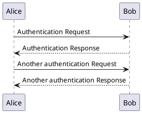

# gatsby-remark-plantuml-lite

[](https://github.com/Mogeko/gatsby-remark-plantuml-lite/actions?query=workflow%3A%22Test+and+Build%22)
[](https://codecov.io/gh/Mogeko/gatsby-remark-plantuml-lite)

**A** light **Gatsby plugin to transform [PlantUML](plantuml.com/) code blocks into SVG images(_without Java and Graphviz_).**

## Install

```
npm install --save gatsby-remark-plantuml-lite gatsby-transformer-remark
```

or

```
yarn add gatsby-remark-plantuml-lite gatsby-transformer-remark
```

## Dependencies

This plugin depends on:

- `gatsby-transformer-remark`

And it will act as a plugin for `gatsby-transformer-remark`.

**This plugin is implemented using pure TypeScript, using the [Server API](http://www.plantuml.com/plantuml/uml/SyfFKj2rKt3CoKnELR1Io4ZDoSa70000) officially provided by PlantUML, and does not need to depends on Java and Graphviz locally.**

## How to use

After [installed](#install), Configure in `gatsby-config.js`:

```javascript
// gatsby-config.js
// ...
plugins: [
  // other plugins ...
  {
    resolve: `gatsby-transformer-remark`,
    options: {
      plugins: [
        `gatsby-remark-code-titles`,
        // Please make sure the order of `gatsby-remark-plantuml-lite`
        // before the `gatsby-remark-prismjs` and 
        // after the `gatsby-remark-code-titles`.
        // If they exist.
        `gatsby-remark-plantuml-lite`,
        `gatsby-remark-prismjs`,
      ],
    },
  },
  // other plugins ...
]
```

> It will support optional configurations in the future.

Then write PlantUML in the code block of Markdown, and specify the language type of `plantuml` in the code block.

For example:

````

````

More PlantUML syntax can be learned in the [official PlantUML documentation](https://plantuml.com/).

## License

The code in this project is released under the [MIT License](https://github.com/Mogeko/gatsby-remark-plantuml-lite/blob/master/LICENSE).
