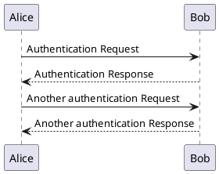

# gatsby-remark-plantuml-lite

[](https://github.com/Mogeko/gatsby-remark-plantuml-lite/actions?query=workflow%3A%22Test+and+Build%22)
[](https://codecov.io/gh/Mogeko/gatsby-remark-plantuml-lite)
[](https://www.npmjs.com/package/gatsby-remark-plantuml-lite)


**A** light **Gatsby plugin to transform [PlantUML][plantuml_home] code blocks into SVG/PNG images(_without Java and Graphviz_).**

## Install

```
npm install --save gatsby-remark-plantuml-lite
```

or

```
yarn add gatsby-remark-plantuml-lite
```

## Dependencies

This plugin depends on:

- `gatsby-transformer-remark` or `gatsby-plugin-mdx`

And it will act as a plugin for `gatsby-transformer-remark` / `gatsby-plugin-mdx`.

**This plugin is implemented using pure TypeScript, using the [Web Server API][plantuml_server] officially provided by PlantUML (or your own PlantUML server), and does not need to depends on Java and Graphviz locally.**

## How to use

After [installed](#install), Configure in `gatsby-config.js`:

```javascript
// gatsby-config.js
// ...
plugins: [
  // other plugins ...
  {
    resolve: `gatsby-transformer-remark`,
    options: {
      plugins: [
        `gatsby-remark-code-titles`,
        // Please make sure the order of `gatsby-remark-plantuml-lite`
        // before the `gatsby-remark-prismjs` and 
        // after the `gatsby-remark-code-titles`.
        // If they exist.
        {
          resolve: `gatsby-remark-plantuml-lite`,
          options: { // Configuration options
            imageType: `svg`
          }
        },
        `gatsby-remark-prismjs`,
      ],
    },
  },
  // other plugins ...
]
// ...
```

This example uses `gatsby-transformer-remark`.

If you want to use with `gatsby-plugin-mdx`, please refer to the [_Gatsby remark plugins_][mdx_gatsby_remark_plugins] chapter of the official documentation.

### Options

Configure this plugin:

```javascript
// other plugins ...
{
  resolve: `gatsby-remark-plantuml-lite`,
  options: { // Configuration options
    imageType: `svg` // `svg` or `png`, default is `svg`
    server: `https://www.plantuml.com/plantuml`, // Customize PlantUML server
  }
},
// other plugins ...
```

Details of configuration options:

|      Name       |     Values     |               Default               |                     Description                      |
| :-------------: | :------------: | :---------------------------------: | :--------------------------------------------------: |
|   `imageType`   | `svg` or `png` |                `svg`                |   Type of PlantUML image returned from Web Server.   |
|     `server`    |  url (string)  | `https://www.plantuml.com/plantuml` | PlantUML server to generate UML diagrams on-the-fly. |
| `codeBlockLang` |  name (string) |              `plantuml`             |             Name of the codeblock languange.         |

### Use in Markdown

Then write PlantUML in the code block of Markdown, and specify the language type of `plantuml` in the code block.

For example:

````

````

This plugin will replace PlantUML code blocks with PlantUML image.

like this:

![PlantUML Example][plantuml_example]

More PlantUML syntax can be learned in the [official PlantUML documentation](plantuml_home).

## License

The code in this project is released under the [MIT License][license].


[plantuml_home]: https://plantuml.com
[plantuml_server]: http://www.plantuml.com/plantuml/uml/SyfFKj2rKt3CoKnELR1Io4ZDoSa70000
[plantuml_example]: https://www.plantuml.com/plantuml/svg/SoWkIImgAStDuNBCoKnELT2rKt3AJx9IS2mjoKZDAybCJYp9pCzJ24ejB4qjBk42oYde0jM05MDHLLoGdrUSoeLkM5u-K5sHGY9MGw6ARNHryQb66EwGcfS2T300

[mdx_gatsby_remark_plugins]: https://www.gatsbyjs.com/docs/mdx/plugins/#gatsby-remark-plugins

[license]: https://github.com/Mogeko/gatsby-remark-plantuml-lite/blob/master/LICENSE
